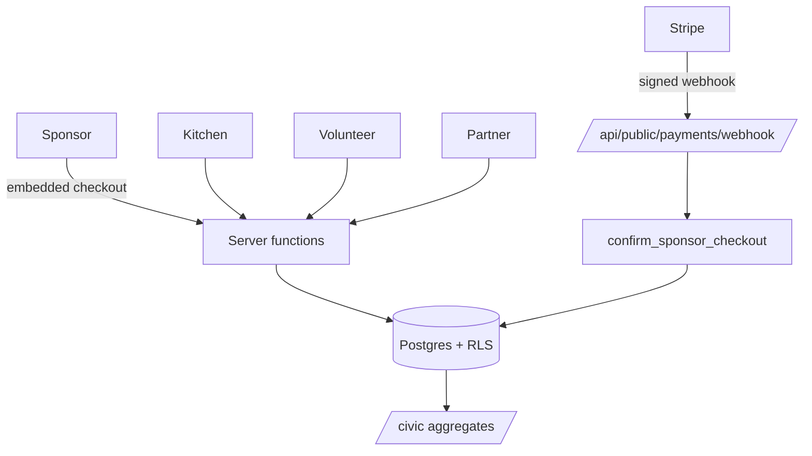
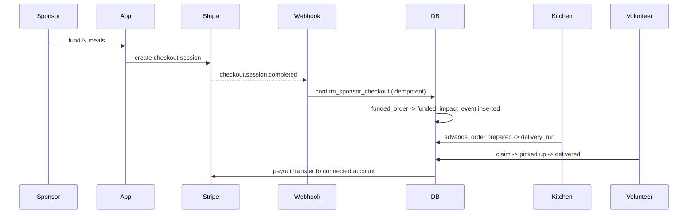

# ProvisionLoop — Design

## Summary

ProvisionLoop is a community food-security network that turns sponsor dollars into
verified, delivered meals from local kitchens. The load-bearing design choice: the
public ledger only counts money that a payment webhook confirmed, at kitchens that
a real operator has claimed — honesty of the number is the product.

## Context & Scope

Launch geography is Galveston County, Texas. The platform spans five surfaces:
households (MealForge planning at `/app`), kitchens (`/kitchen`), sponsors
(`/impact`), nonprofit partners (`/partners`), volunteers (`/volunteer`) and a
public civic dashboard (`/civic`). Stack: TanStack Start (React 19, Vite) on
Cloudflare Workers, with Lovable Cloud (Supabase) for auth, Postgres and RLS, and
Stripe in test mode for funding and connected-account payouts.

Out of scope for this document: marketing, per-screen UI copy, and the food
intelligence algorithms in `src/lib/food/` (documented at the module level).

## Problem Statement

Meal-donation platforms routinely overstate impact: they count pledges as meals,
list kitchens that never agreed to participate, and cannot show a city where the
unmet demand actually is. Building the honest version is hard because it requires
payment confirmation, operator consent, recipient privacy and geographic
aggregation to all hold simultaneously.

## Goals

- No meal appears in a public total unless a payment was confirmed by webhook.
- No money can move to a kitchen that has not been claimed and payout-verified.
- Household identity never reaches a sponsor, volunteer or civic surface.
- Civic aggregates are usable for planning: demand vs. capacity by area, 7/30/90-day windows, CSV export.
- Every legal acceptance is recorded server-side, versioned, and unbypassable from the UI.

## Non-Goals

- Not live payments in v1 — Stripe stays in test mode until pilot terms are settled.
- Not a nonprofit or a 501(c)(3) intermediary; no tax-deductibility claims.
- Not national in v1 — geography, seed data and partner rules are Galveston County.
- Not building our own auth, payments ledger, or mapping stack.
- Not real-time delivery tracking; runs are claim → picked up → delivered, not GPS.
- Not household-level public reporting, at any cohort size.

## Requirements Traceability

Feature-level status and acceptance state live in `roadmap.md`. Legal document
versions and their required acceptance contexts are enumerated in
`src/lib/legal/registry.ts`, which is the traceability source for the legal gate.

## Design

### Overview

A single Postgres database with RLS as the primary authorization boundary; all
app-internal logic runs through `createServerFn` (no edge functions), and only
external callers (the Stripe webhook) use file routes under
`src/routes/api/public/*`. Money and role changes route through security-definer
RPCs (`fund_meals`, `advance_order`, `confirm_sponsor_checkout`, claim/dispatch)
so a single trusted path enforces each invariant.

### Architecture

### Components & Interfaces

- `src/lib/community.ts` — kitchen directory, provider states, `listFundableKitchens()`.
- `src/lib/payments.functions.ts` + `src/lib/stripe.server.ts` — checkout, payout onboarding, transfers.
- `src/lib/volunteer.ts` — profiles, shifts, signups, delivery runs.
- `src/lib/partners.ts` / `src/lib/assistance.ts` — referrals, verification, private intake.
- `src/lib/civic.ts` — aggregate-only reads for the public dashboard.
- `src/lib/legal/*` + `useLegalGate` — versioned acceptance capture and enforcement.
- `src/lib/admin.ts` + `/admin` — privacy, refund and pilot queues, admin-gated.

### Data Models

Only the trade-off-bearing parts: `kitchens` carry `claimed`, `payout_status`,
`is_test` and coordinates — these four columns are the funding gate.
`funded_orders` are written `pending` and flip to funded only from the webhook
path. `impact_events` is append-only and is the sole input to public totals.
Roles live in `user_roles` and are read through `has_role()`, never from a profile
column.

### APIs / Interfaces

Typed RPC via server functions for everything in-app; one public HTTP surface, the
Stripe webhook, signature-verified and idempotent by event id.

### Sequence & State

## Cross-Cutting Concerns

### Security & Privacy

RLS on every public table with explicit GRANTs; security-definer helpers instead of
broad policies; anonymous execute revoked on all internal functions. Volunteers see
a kitchen or drop point, never a household. Civic reads are aggregate with a
minimum-cohort suppression threshold.

### Performance & Scale

Pilot scale is a single county; reads are indexed by kitchen, area and date.
Civic windows are bounded to 90 days. No caching layer yet — deliberate.

### Observability / Logging

Server function logs plus Stripe webhook event ids; payout status is persisted per
transfer rather than re-fetched.

## Error Handling

Funding paths fail closed with a stated reason ("This kitchen is not yet accepting
funding."). Webhook retries are safe by construction. Legal gates throw from inside
the handler via `assertAccepted()` so a disabled-button bypass cannot succeed.

## Testing Strategy

Typecheck (`tsgo`), ESLint, production build, and route smoke tests through
Playwright against the running dev server. Payment flows are exercised against the
Stripe sandbox with `4242 4242 4242 4242`. The database linter is run after every
migration.

## Alternatives Considered

### Alternative 1: Count pledges immediately, reconcile later

- Trade-offs: better-looking early numbers, simpler code, no webhook dependency.
- Why not chosen: the public ledger's only value is that it is true; a reconcilable number is a false number in the window that matters.

### Alternative 2: Seed real kitchens as fundable partners

- Trade-offs: a non-empty funding gate on day one.
- Why not chosen: claiming a partnership no operator agreed to is the exact dishonesty the platform exists to avoid. Seeded rows are unclaimed listings; only clearly labelled test-mode kitchens are fundable.

### Alternative 3: Supabase edge functions for server logic

- Trade-offs: familiar Deno runtime, independent deploys.
- Why not chosen: the app already runs a Worker; `createServerFn` keeps types end-to-end and avoids a second deploy target and auth surface.

### Alternative 4: Store roles on the profile row

- Trade-offs: one fewer table and join.
- Why not chosen: client-writable role columns are a privilege-escalation path.

## Risks & Open Questions

- Email notifications for admin queues are blocked on owning a sending domain (owner: Garrett).
- 19 pre-existing SECURITY DEFINER linter warnings remain open.
- End-to-end sandbox sponsorship → delivery → payout has not been run with a signed-in session.
- Pilot date (Nov 3 2026) and eligibility wording are provisional.

## Dependencies

Lovable Cloud (Supabase), Stripe (test mode), Cloudflare Workers, TanStack Start,
Tailwind v4, shadcn/ui.

## Rollout / Migration Plan

Preview build is current; the published URL lags until the next publish. Migrations
are forward-only SQL with GRANTs and RLS in the same file. Test-mode kitchens are
flagged `is_test` and are removable without touching real listings.

## Success Metrics

Confirmed-paid meals, delivered meals, claimed kitchens, active volunteers,
unmet-demand gap by area, and zero public totals traceable to unpaid pledges.

## Glossary

- **Claimed listing** — a directory kitchen whose real operator has taken ownership.
- **Funding gate** — the combined approved + active + claimed + payout-ready check.
- **Impact event** — the append-only row behind every public number.

## Changelog

- 2026-09-05 v1.0.0 — Retrofit design doc for the shipped system (Garrett McLain)
